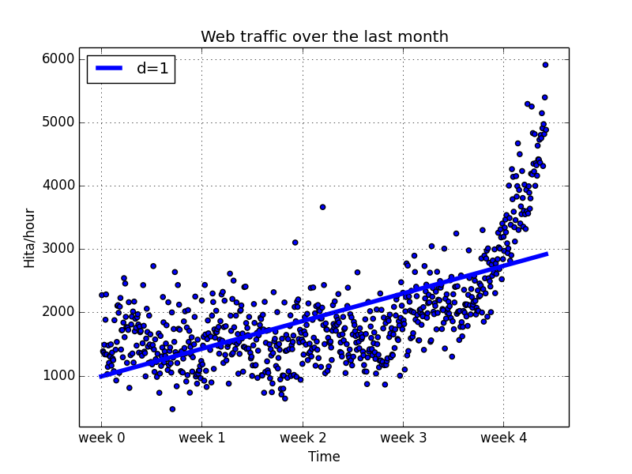
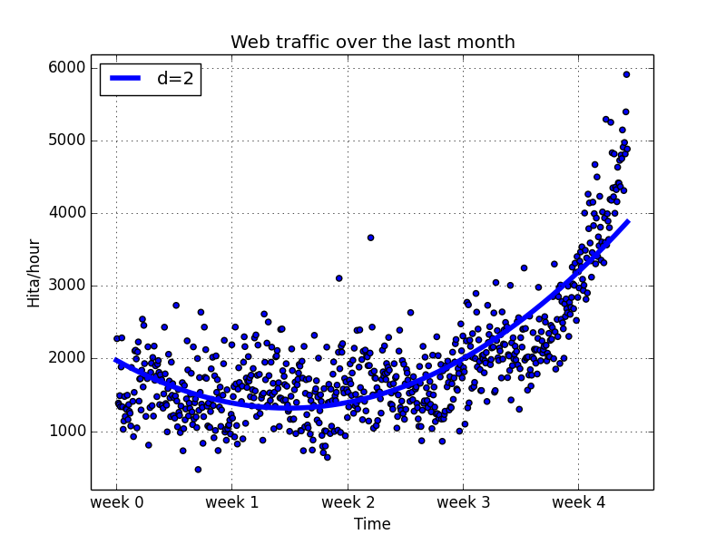

##预估网站访问量（我们第一个机器学习应用）

目的：预测一个网站的访问量

##数据格式
数据格式：  x  y  以Tab分割
 
- x 代表某一个小时  
- y 代表那一个小时内的Web访问数  

##清理数据
发现y值存在8个nan值，删除

##选择模型和学习算法

####近似误差

    def error(f, x, y):
        return sp.sum((f(x) - y)**2 )

近似误差是衡量一个模型是否正确的一个标准，这里是预测值与真实值的差的平方

####选择一阶模型
效果如图：

计算近似误差：
f(x) =2.59619213 * x + 989.02487106  
得到的误差值为： 317389767.34

####选择二阶多项式模型
效果如图：

计算近似误差：
f(x) =0.0105322215e* x**2 - 5.26545650 * x +1974.76082e 
得到的误差值为： 179983507.878

发现二阶多项式比直线模型误差更小

####比较N阶多项式

